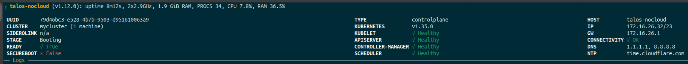

# Triton [No Cloud](https://cloudinit.readthedocs.io/en/latest/reference/datasources/nocloud.html) Images

Creates manifest and image files for testing [OS-8711](https://github.com/TritonDataCenter/smartos-live/tree/OS-8711)

Images and manifests are available in Manta:

- Alpine ([manifest](https://us-central.manta.mnx.io/tpaul/public/nocloud/alpine-20260114.json) / [image](https://us-central.manta.mnx.io/tpaul/public/nocloud/alpine-20260114.x86_64.zfs.gz))
- FreeBSD ([manifest](https://us-central.manta.mnx.io/tpaul/public/nocloud/freebsd-20260114.json) / [image](https://us-central.manta.mnx.io/tpaul/public/nocloud/freebsd-20260114.x86_64.zfs.gz))
- Debian ([manifest](https://us-central.manta.mnx.io/tpaul/public/nocloud/debian-13-20260114.json) / [image](https://us-central.manta.mnx.io/tpaul/public/nocloud/debian-13-20260114.x86_64.zfs.gz))
- Talos ([manifest](https://us-central.manta.mnx.io/tpaul/public/nocloud/talos-20260205.json) / [image](https://us-central.manta.mnx.io/tpaul/public/nocloud/talos-20260205.x86_64.zfs.gz))

Test [PI](https://us-central.manta.mnx.io/tpaul/public/nocloud/platform-20260209T220841Z.tgz)

## Talos Example

```
$ cd /opt
$ curl -O https://us-central.manta.mnx.io/tpaul/public/nocloud/talos-20260205.json
$ curl -O https://us-central.manta.mnx.io/tpaul/public/nocloud/talos-20260205.x86_64.zfs.gz
$ imgadm install -m talos-20260205.json -f talos-20260205.x86_64.zfs.gz
$ cat <<'EOF' | vmadm create
{
  "alias": "talos-nocloud",
  "hostname": "talos-nocloud",
  "brand": "bhyve",
  "ram": 2048,
  "vcpus": 2,
  "cpu_cap": 200,
  "resolvers": [
    "1.1.1.1",
    "8.8.8.8"
  ],
  "nics": [
    {
      "nic_tag": "admin",
      "ips": [
        "172.16.26.32/23"
      ],
      "gateways": [
        "172.16.26.1"
      ],
      "model": "virtio"
    }
  ],
  "disks": [
    {
      "image_uuid": "5ba204e6-9f76-4952-a288-37db7b2182ea",
      "boot": true,
      "model": "virtio",
      "size": 10240
    }
  ],
  "flexible_disk_size": 10240,
  "customer_metadata": {}
}
EOF
```

After creation, optionally, wait for Talos to come up fully (It's by far the fastest to boot of any examples here):

```
$ vmadm console $(vmadm list -Ho uuid alias=talos-nocloud)
```

On another machine that has [talosctl](https://docs.siderolabs.com/talos/v1.10/getting-started/talosctl) installed:

```
# Confirm image is up and responding (also get install disk ID)
$ talosctl get disks --nodes 172.16.26.32 --insecure
NODE   NAMESPACE   TYPE   ID      VERSION   SIZE     READ ONLY   TRANSPORT   ROTATIONAL   WWID   MODEL   SERIAL
       runtime     Disk   loop0   2         201 kB   true                                                
       runtime     Disk   loop1   2         4.1 kB   true                                                
       runtime     Disk   loop2   2         7.9 MB   true                                                
       runtime     Disk   loop3   2         75 MB    true                                                
       runtime     Disk   vda     2         11 GB    false       virtio      true                        BHYVE-BD33-69F2-D808
       runtime     Disk   vdb     2         17 MB    false       virtio      true                        BHYVE-82B7-2169-64F6

# Generate talos configs
$ talosctl gen config mycluster https://172.16.26.32:6443 --install-disk /dev/vda
generating PKI and tokens
Created /home/travis/src/triton/nocloud-images/controlplane.yaml
Created /home/travis/src/triton/nocloud-images/worker.yaml
Created /home/travis/src/triton/nocloud-images/talosconfig

# Apply the talos configs
$ talosctl apply-config --insecure --nodes 172.16.26.33 --file controlplane.yaml

# Watch the dashboard until you see:
# etcd is waiting to join the cluster, if this node is the first node in the cluster, please run `talosctl bootstrap`

$ talosctl dashboard --nodes 172.16.26.32 -e 172.16.26.32 --talosconfig talosconfig

# Then bootstap
$ talosctl bootstrap -n  172.16.26.32 -e 172.16.26.32 --talosconfig talosconfig

# Watch dashboard again until the cluster is up (see screenshot below)
```




### Talos Triton

You'll need the updated [PI](https://us-central.manta.mnx.io/tpaul/public/nocloud/platform-20260209T220841Z.tgz) booted on the target CNs.

```
# Choose a predictable FQDN for the control node endpoint (e.g. created by CNS)
# Needs to be in the talos config so needs to be known ahead-of-time
export CTRL=ctrl.svc.travis.ext.corp

# Create directory for config files
mkdir -p ~/talos-test && cd ~/talos-test

# Generate config files for cluster
talosctl gen config test-cluster https://$CTRL:6443 --install-disk /dev/vda --additional-sans $CTRL

# Export talos config and set endpoint
export TALOSCONFIG=talosconfig
talosctl config endpoint $CTRL

# Create Talos VMs (control node and two worker nodes) using configs
triton inst create -t triton.cns.services=k8s,worker -n talos-w1 talos sample-4G -m "cloud-init:user-data=$(cat worker.yaml)"
triton inst create -t triton.cns.services=k8s,worker -n talos-w2 talos sample-4G -m "cloud-init:user-data=$(cat worker.yaml)"
triton inst create -w -t triton.cns.services=k8s,ctrl -n talos-ctrl talos sample-4G -m "cloud-init:user-data=$(cat controlplane.yaml)"

# bootstrap talos and cluster
talosctl bootstrap -n $CTRL

# Wait for cluster to be ready
talosctl health --nodes $CTRL

# Generate kube config
talosctl kubeconfig --nodes $CTRL ~/.kube/config

# List nodes and pods
kubectl get nodes -o wide
kubectl get pods -A -o wide

# test launching a pod
kubectl run test --image=nginx --restart=Never
kubectl get pods -o wide
kubectl port-forward pod/test 8080:80 &
curl -sS http://127.0.0.1:8080 | head
```

## FreeBSD Example

```
$ cd /opt
$ curl -O https://us-central.manta.mnx.io/tpaul/public/nocloud/freebsd-20260114.json
$ curl -O https://us-central.manta.mnx.io/tpaul/public/nocloud/freebsd-20260114.x86_64.zfs.gz
$ imgadm install -m freebsd-20260114.json -f freebsd-20260114.x86_64.zfs.gz
$ cat <<'EOF' | vmadm create
{
  "alias": "freebsd-nocloud",
  "hostname": "freebsd-nocloud",
  "brand": "bhyve",
  "ram": 2048,
  "vcpus": 2,
  "bootrom": "uefi",
  "cpu_cap": 200,
  "resolvers": [
    "1.1.1.1",
    "8.8.8.8"
  ],
  "nics": [
    {
      "nic_tag": "admin",
      "ips": [
        "172.16.26.32/23"
      ],
      "gateways": [
        "172.16.26.1"
      ],
      "model": "virtio"
    }
  ],
  "disks": [
    {
      "image_uuid": "6590acfa-c596-4e77-aa5d-dba330b49e20",
      "boot": true,
      "model": "virtio",
      "size": 10240
    }
  ],
  "flexible_disk_size": 10240,
  "customer_metadata": {
     "cloud-init:user-data": "#cloud-config\nusers:\n  - name: freebsd\n    ssh_authorized_keys:\n      - ssh-ed25519 AAAAC3NzaC1lZDI1NTE5AAAAIMI+EAg62hwbsaEmdNSJbKB2mc+cnTQu63KJwhcAx/sN tpaul@edgecast.io\n"
  }
}
EOF
```

After creation, optionally, wait for FreeBSD to come up fully:

``` 
$ vmadm console $(vmadm list -Ho uuid alias=freebsd-nocloud)
```

Test SSH:

```
$ ssh freebsd@172.16.26.32
```

## Alpine Example

```
$ cd /opt
$ curl -O https://us-central.manta.mnx.io/tpaul/public/nocloud/alpine-20260114.json
$ curl -O https://us-central.manta.mnx.io/tpaul/public/nocloud/alpine-20260114.x86_64.zfs.gz
$ imgadm install -m alpine-20260114.json -f alpine-20260114.x86_64.zfs.gz
$ cat <<'EOF' | vmadm create
{
  "alias": "alpine-nocloud",
  "hostname": "alpine-nocloud",
  "brand": "bhyve",
  "ram": 2048,
  "vcpus": 2,
  "bootrom": "uefi",
  "cpu_cap": 200,
  "resolvers": [
    "1.1.1.1",
    "8.8.8.8"
  ],
  "nics": [
    {
      "nic_tag": "admin",
      "ips": [
        "172.16.26.32/23"
      ],
      "gateways": [
        "172.16.26.1"
      ],
      "model": "virtio"
    }
  ],
  "disks": [
    {
      "image_uuid": "af500520-195e-45d0-9043-848912b683cb",
      "boot": true,
      "model": "virtio",
      "size": 10240
    }
  ],
  "flexible_disk_size": 10240,
  "customer_metadata": {
     "cloud-init:user-data": "#cloud-config\nusers:\n  - name: alpine\n    ssh_authorized_keys:\n      - ssh-ed25519 AAAAC3NzaC1lZDI1NTE5AAAAIMI+EAg62hwbsaEmdNSJbKB2mc+cnTQu63KJwhcAx/sN tpaul@edgecast.io\n\nchpasswd:\n  list: |\n    root:root\n    alpine:alpine\n  expire: false"
  }
}
EOF
```

After creation, optionally, wait for Alpine to come up fully:

``` 
$ vmadm console $(vmadm list -Ho uuid alias=alpine-nocloud)
```

Test SSH:

```
$ ssh alpine@172.16.26.32
```


## Debian Example

```
$ cd /opt
$ curl -O https://us-central.manta.mnx.io/tpaul/public/nocloud/debian-13-20260114.json
$ curl -O https://us-central.manta.mnx.io/tpaul/public/nocloud/debian-13-20260114.x86_64.zfs.gz
$ imgadm install -m debian-13-20260114.json -f debian-13-20260114.x86_64.zfs.gz
$ cat <<'EOF' | vmadm create
{
  "alias": "debian-nocloud",
  "hostname": "debian-nocloud",
  "brand": "bhyve",
  "ram": 2048,
  "vcpus": 2,
  "bootrom": "uefi",
  "cpu_cap": 200,
  "resolvers": [
    "1.1.1.1",
    "8.8.8.8"
  ],
  "nics": [
    {
      "nic_tag": "admin",
      "ips": [
        "172.16.26.32/23"
      ],
      "gateways": [
        "172.16.26.1"
      ],
      "model": "virtio"
    }
  ],
  "disks": [
    {
      "image_uuid": "708b47bf-8de7-4085-85eb-dc96fabdd745",
      "boot": true,
      "model": "virtio",
      "size": 10240
    }
  ],
  "flexible_disk_size": 10240,
  "customer_metadata": {
     "cloud-init:user-data": "#cloud-config\nusers:\n  - name: debian\n    ssh_authorized_keys:\n      - ssh-ed25519 AAAAC3NzaC1lZDI1NTE5AAAAIMI+EAg62hwbsaEmdNSJbKB2mc+cnTQu63KJwhcAx/sN tpaul@edgecast.io\n"
  }
}
EOF
```

After creation, optionally, wait for Debian to come up fully:

``` 
$ vmadm console $(vmadm list -Ho uuid alias=debian-nocloud)
```

Test SSH:

```
$ ssh debian@172.16.26.32
```
